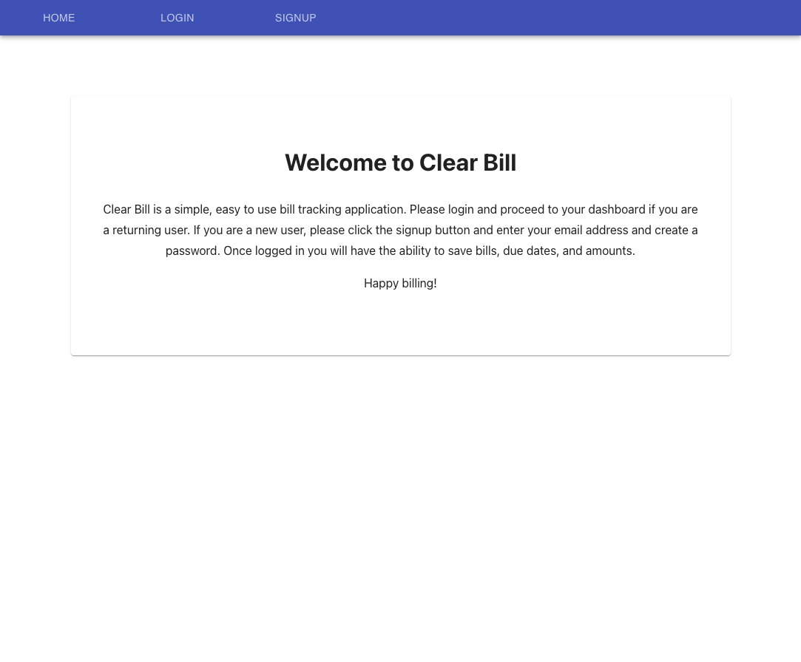
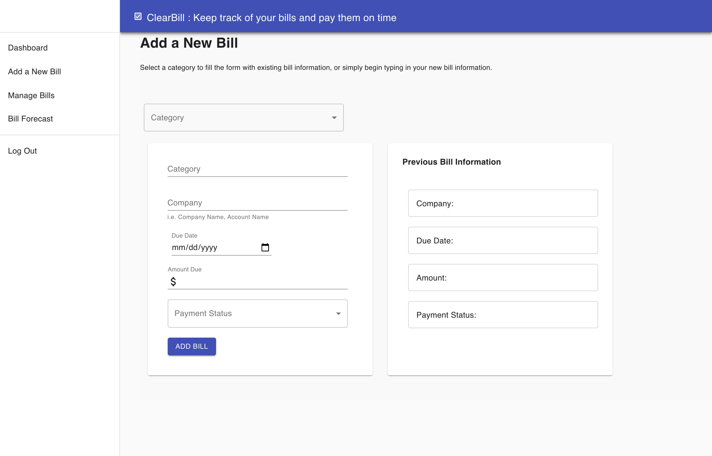

# Clear Bills

## User Story
As a user I want to keep track of my bills so that I can pay them on time and predict future bill amounts.

## Description
Clear Bill is an application designed to help users organize and view all of their outstanding bills, amounts, and due dates. Users can view existing bills and bill information in the dashboard, add new bills, edit bills, and mark bills as paid.

* Forked Repository:https://github.com/suejinkim20/clear-bills
* Forked Deployed Site: https://clear-bills-demo.herokuapp.com/

* Originial Group GitHub Repository: https://github.com/snbarnhouse/mvp_bill_tracker 
* Originial Heroku Deployed Site: https://clear-bill.herokuapp.com/ 

## User experience
1. User signs up by using a form to create a new & unique account associated with their email address.
2. User adds a secure password to protect their account.
3. User enters current bill amounts, due dates & schedule of recurring bills into a form.

## Tech used in this project
* Javascript
* React.js: Component based interactive UI
* Material UI: React UI framework with prebuilt components
* Node.js / Express.js: Server side event driven platform
* Apollo / GraphQL: Connected data between backend and frontend
* MongoDB / Mongoose: NoSQL database and querying language
* Heroku / MongoDB Atlas Cloud: Deployment and management of cloud data
* Bcrypt: password hashing
* JSON Web Token: user authentication

## Minimum viable product
Front end user should be able to:
1. Sign up [create account]
2. Log in [enter user interface]
3. Enter bill payment data

## Directions for Future Development
1. Allow users to make payments withn the app
2. Allow multiple users to share bills and split payments
3. Bill forecast to predict future bills
4. Overdue status on bills/notifications when overdue
